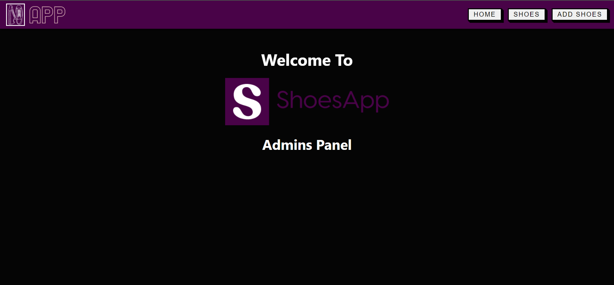
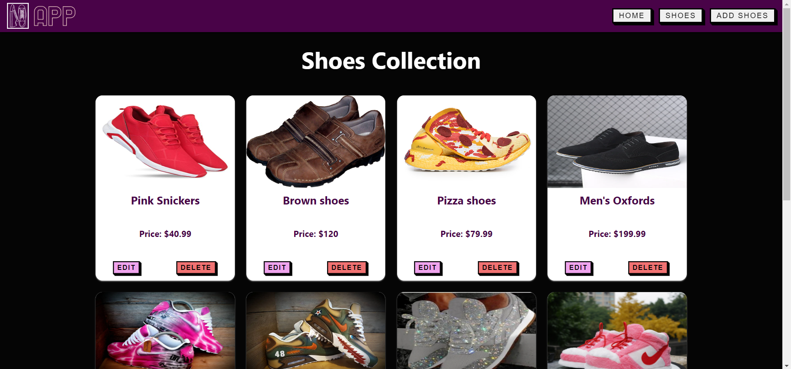
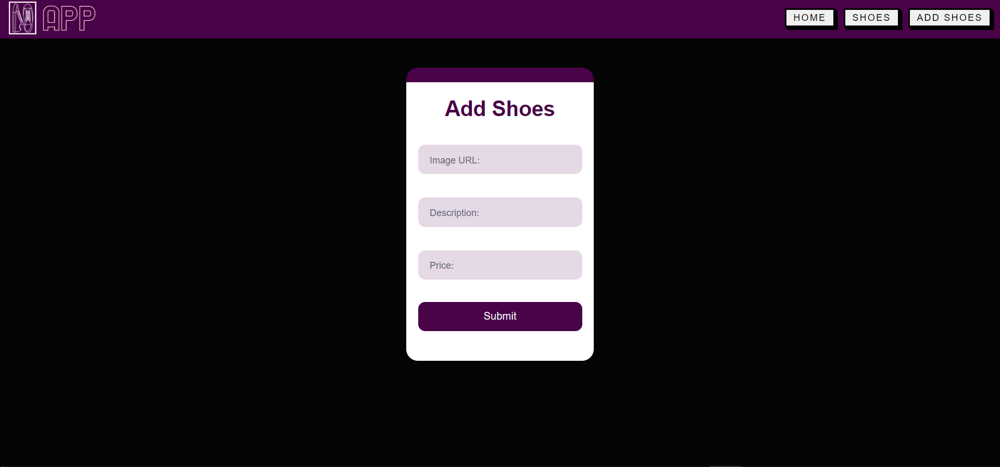
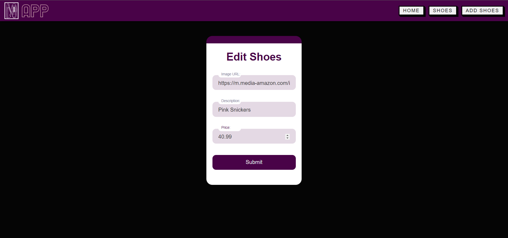
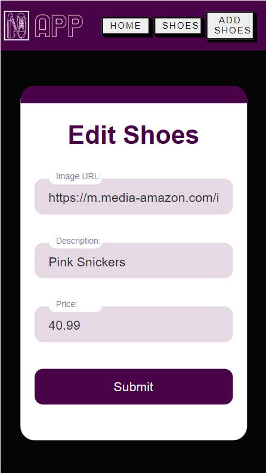
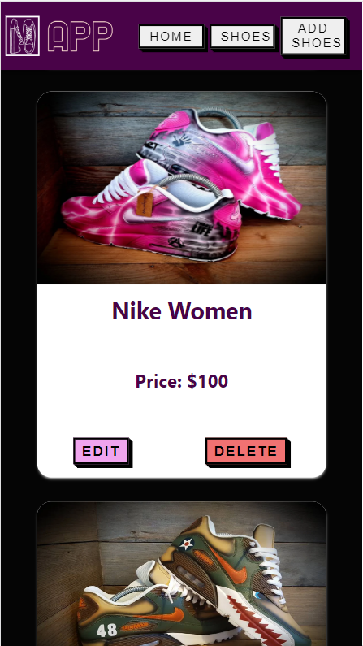

[](https://git.io/typing-svg)

<hr>

### I was given a task @AppleSeeds Bootcamp to make an admin panel for a shoes store while making sure that:

<br>

[](https://git.io/typing-svg)

<br>

[](https://git.io/typing-svg)

<br>

[](https://git.io/typing-svg)


## My implementation

My implementation was straightforward, I made a Navbar and a total of four Routs:

- `Home page` - Logo will show on that page and it is a basic landing page

- `Shoes collection page` - Will display all the shoes you have in the Database in a form of cards with two button: Delete / Edit.

- `Edit item page` - Will display a form with the item info, you can change some of the info and submit, after that an alert with success message will appear, checking it will take you back to the collection page.

- `Add shoes page` - Will display a form, you can insert data for the new shoes and after clicking submit you will see an alert that indicates you added the new item. after that you will be redirected to the collection page again.


## Prerequisites
* Database server configured with the keys needed for the shoes in the app: ```{imgUrl, description, price}```
* Set up the api.js to have the right api to access your own Database
* Small cup of coffee 😉☕


<br>

# Screenshots:
 

 

 

 

<br>

## Responsiveness:






<br>
<br>

[](https://git.io/typing-svg)

In order to run the app locally you will need to install all the dependencies from the package.json file.  
Run the command ``` npm install ``` to install all the dependencies, after it's done you can run ``` npm start``` to start the app locally in ```localhost:3000```


<br>


# Summary
By going through all the steps and making sure you have the prerequisites you:
- Deployed the shoes store Admins panel app locally with all the dependencies needed.
- Can Edit/Delete/Add shoes on you Admins panel app.

<br>

## `Feel free to contact me`:


[](https://www.linkedin.com/in/elad-harel-06ab61183/)
[](mailto:benben95939@gmail.com)
